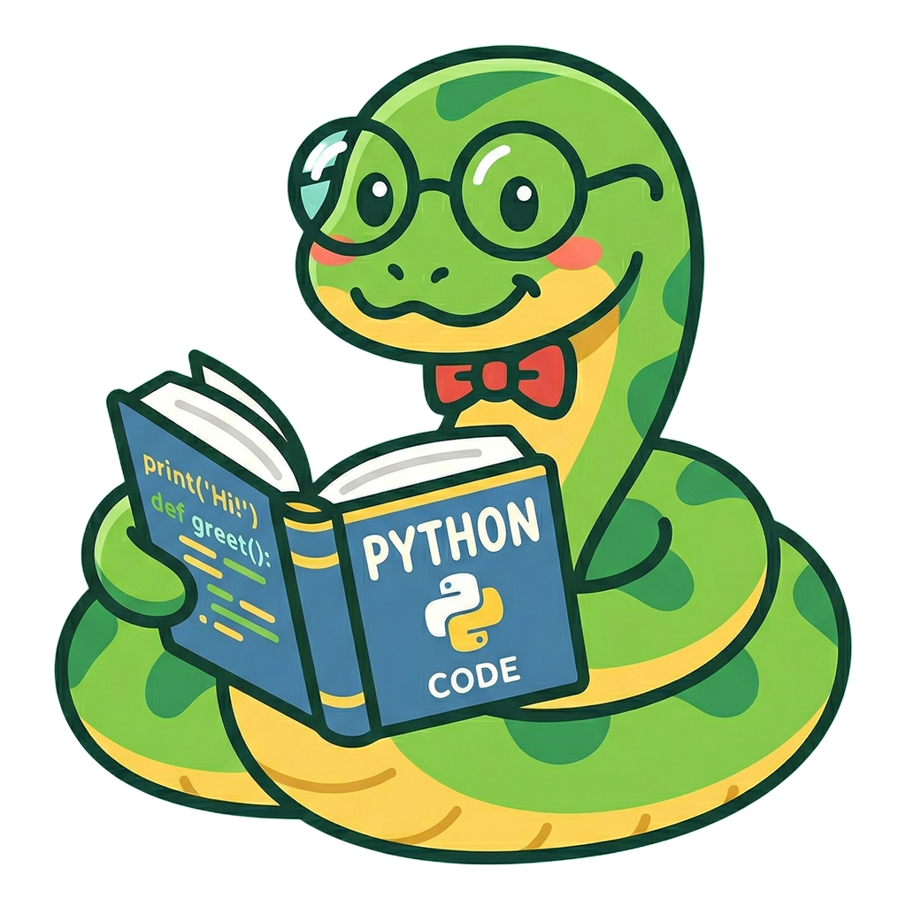

# Professor Python



Tutor de Python para iniciantes absolutos, construído com Streamlit e integrado à API da Groq.

Teste o projeto: [https://prof-python.streamlit.app/](https://prof-python.streamlit.app/)

## Visão geral

O **Professor Python** é um aplicativo de chat educacional com foco em ensino didático e progressivo de Python.  
A aplicação foi desenhada para:

- ensinar em **micro-etapas** (um passo por vez),
- usar **analogias do dia a dia** para facilitar compreensão,
- responder em **português brasileiro**,
- manter histórico da conversa durante a sessão.

A interface exibe:

- avatar e identidade visual do Professor Python,
- histórico de mensagens no formato chat,
- entrada de pergunta em linguagem natural,
- resposta gerada por IA via Groq.

## Funcionalidades

- Chat interativo com Streamlit (`st.chat_message`, `st.chat_input`)
- Memória de conversa em sessão (`st.session_state`)
- Prompt de sistema robusto para controlar estilo didático
- Integração com modelo da Groq (`llama-3.1-8b-instant`)
- Tratamento básico de erro para indisponibilidade temporária da API

## Stack do projeto

- **Python**
- **Streamlit**
- **Groq SDK**

Dependências em `requirements.txt`:

- `streamlit`
- `groq`

## Estrutura atual

```text
.
├── app.py
├── requirements.txt
├── professor.png
├── .streamlit/
└── README.md
```

## Como executar localmente

### 1. Clonar o repositório

```bash
git clone https://github.com/OYanEnrique/professor-python.git
cd professor-python
```

### 2. Criar e ativar ambiente virtual (recomendado)

No Windows (PowerShell):

```powershell
python -m venv .venv
.\.venv\Scripts\Activate.ps1
```

No Linux/macOS:

```bash
python -m venv .venv
source .venv/bin/activate
```

### 3. Instalar dependências

```bash
pip install -r requirements.txt
```

### 4. Configurar segredo da API da Groq

Crie/edite o arquivo `.streamlit/secrets.toml` com:

```toml
GROQ_API_KEY = "sua_chave_aqui"
```

> Sem essa chave, o app não consegue gerar respostas da IA.

### 5. Rodar o aplicativo

```bash
streamlit run app.py
```

Depois, abra o endereço mostrado no terminal (normalmente `http://localhost:8501`).

## Como o app funciona

Fluxo simplificado:

1. Define configuração visual da página (título, ícone e layout).
2. Inicializa cliente Groq com chave em `st.secrets`.
3. Define um **prompt de sistema** com regras didáticas rígidas.
4. Armazena mensagens na sessão (`st.session_state.mensagens`).
5. Renderiza histórico do chat na interface.
6. Recebe nova pergunta do usuário.
7. Envia histórico completo para a API da Groq.
8. Exibe resposta da IA e salva no histórico.

## Boas práticas recomendadas

- Não versionar chaves de API no Git.
- Manter `.streamlit/secrets.toml` fora do controle de versão.
- Fixar versões no `requirements.txt` para maior reprodutibilidade.
- Adicionar testes de prompts/comportamento conforme o projeto evoluir.

## Possíveis melhorias futuras

- Botão para limpar histórico de conversa.
- Seleção de modelo na interface.
- Streaming de tokens em tempo real.
- Observabilidade (logs de erro e métricas).
- Validação de entrada e limites de tamanho de prompt.

## Contribuição

Sugestões e PRs são bem-vindos.

Fluxo sugerido:

1. Crie uma branch para sua feature/correção.
2. Faça commits pequenos e descritivos.
3. Abra um Pull Request explicando o objetivo da mudança.

## Autor

Desenvolvido por **Yan Enrique**  
GitHub: [@OYanEnrique](https://github.com/OYanEnrique)

## Licença

Este projeto está sob a licença **MIT**. Consulte o arquivo `LICENSE` para mais detalhes.
